# Retail chatbot

We partnered with Adastra to bring to life an end-to-end smart retail store scenario, powered by Microsoft technology. One piece of this solution was a chat bot with the purpose of showcasing how its conversational interface could help retailers engage their customers in a different and innovative way.

# Customer Profile

[Adastra](https://www.adastra.cz) is an international consulting company with over 20 years of experience in providing comprehensive software solutions and services tailored to the specific needs of businesses. Adastra has built and continue to develop a dominant position in the field of Information Management in four key competencies – Data Warehousing, Business Intelligence, including Mobile BI, Master Data Managementand Enterprise Application Integration. Among clients in the Czech Republic areAhold, Cetelem, ČSOB, ČSOB Pojišťovna, Equa bank, GE Money bank, PPF, ŠkodaAuto, Tipsport, Telefonica O2, Vodafone. The European activities of AdastraGroup are managed from our headquarters in Prague and our branches in London,Frankfurt, Bratislava, Sofia and Moscow. Adastra offices for North America arein Toronto and New York.

[Awards](http://www.adastra.cz/en/about-adastra/awards): Canada´s 50 Best Managed Companies, TOP 100 2014, IT Project ofthe year – 2012, European Business Award, Via Bona 2012, ISO 9001:2009,ISO 27001:2005

25 Solutions: [http://www.adastra.cz/en/business-solutions](https://na01.safelinks.protection.outlook.com/?url=http%3A%2F%2Fwww.adastra.cz%2Fen%2Fbusiness-solutions&data=02%7C01%7CMartin.Simecek%40microsoft.com%7C9bc10cbc7d1f40ed015108d48af60ea3%7C72f988bf86f141af91ab2d7cd011db47%7C1%7C0%7C636286236792607439&sdata=r9L39fCoXVNl1jGiMXyMfsJRTqcB5WQyJHZGBhX3Aa4%3D&reserved=0) 

Technology: [http://www.adastra.cz/en/technology](https://na01.safelinks.protection.outlook.com/?url=http%3A%2F%2Fwww.adastra.cz%2Fen%2Ftechnology&data=02%7C01%7CMartin.Simecek%40microsoft.com%7C9bc10cbc7d1f40ed015108d48af60ea3%7C72f988bf86f141af91ab2d7cd011db47%7C1%7C0%7C636286236792607439&sdata=UbnMOBjfZYryX4lJrwPxjEWjjjhm4AcZNKNcSshon9A%3D&reserved=0) 

# Problem statement

This chatbot takes part in the Retail Store of the Future installation. First shown at the DOTS 2017 conference in Prague, it showcased how an electronic conversational interface could complement both brick&mortar store and an e-shop.


The chatbot was integrated into a [mocked up e-shop website](http://dots-bot.azurewebsites.net/Site/index.html), using Microsoft Bot Framework's embedded Web Chat control, and served four specific purposes:

1. *Finding the nearest Store (to user's location).*
2. *Checking user's order's status.*
3. *Answering general questions related to shopping in this store.*
4. *Filing complaints in case the user was not satisfied with something.*

All of this could be achieved via website or in person, but chatbot allowed to complete those tasks more efficiently.

> It's important to emphasize that the bot **cannot browse goods and search the e-shop**. This is deliberate - we believe that the existing website serves this purpose better and chatbot wouldn't bring much value to it.

# Core Team

* Martin Šimeček - Technical Evangelist, Microsoft
* Robert Havránek - PMM, Microsoft
* Martin Záruba - Developer, Adastra

# Key Technologies

* [Bot Builder C# SDK](https://github.com/Microsoft/BotBuilder)
* [Microsoft Bot Framework](https://dev.botframework.com/) (optimized for Web Chat)
* [QnA Maker service](https://qnamaker.ai/)
* [Bing Maps API](https://msdn.microsoft.com/en-us/library/ff701702.aspx) 
* [Mapy.cz API](http://api.mapy.cz/)
* [Azure App Service](https://azure.microsoft.com/en-us/services/app-service/)
* [Application Insights](https://azure.microsoft.com/en-us/services/application-insights/)

# Solution

In this writeup we will not be going through the process of creating a bot using Microsoft Bot Framework, but instead focus on interesting parts of this particular solution.

## Conversation structure

Overall, the conversation structure is designed to lead the user without much typing or guessing what to do next. It begins with a menu with four buttons, each of them navigating to one of the areas, represented by separate Dialogs.

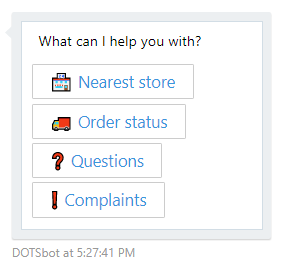

After picking an option, the user is routed to appropriate sub-dialog and the conversation continues. This picture contains the whole flow:

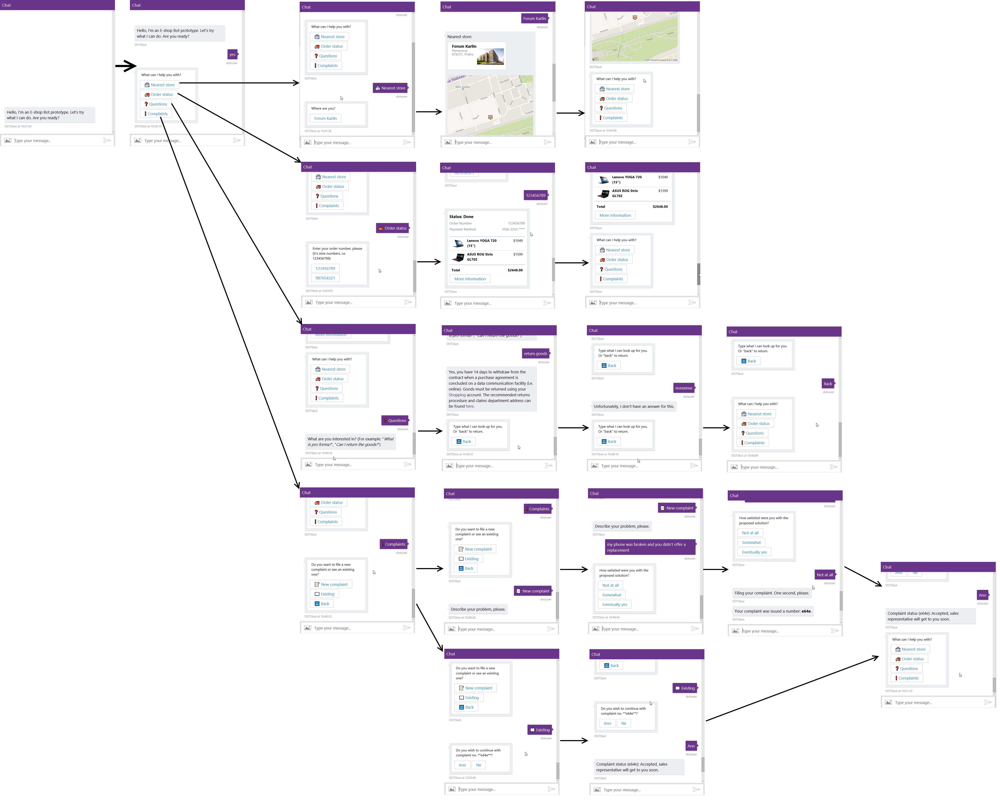

In code, each area exists as an instance of `IDialog`.

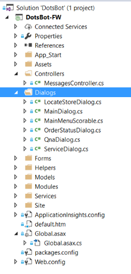

There's nothing too special about the routing. It runs inside a **PromptDialog**, repeating four options until the user picks one, then moving control to a corresponding Dialog.

```c#
private void ShowOptions(IDialogContext context)
{
    var choices = new List<string>() {
        Tasks.LocateStore,
        Tasks.OrderStatus,
        Tasks.QnA,
        Tasks.Service
    };

    PromptDialog.Choice(context,
        AfterTaskSelected,
        choices,
        "What can I help you with?",
        promptStyle: PromptStyle.Keyboard,
        attempts: 99
    );
}

private async Task AfterTaskSelected(IDialogContext context, IAwaitable<string> result)
{
    var res = await result;
    switch (res)
    {
        case Tasks.LocateStore:
            context.Call(new LocateStoreDialog(), AfterTaskCompleted);
            break;
        case Tasks.QnA:
            context.Call(new QnaDialog(), AfterTaskCompleted);
            break;
        case Tasks.Service:
            context.Call(new ServiceDialog(), AfterTaskCompleted);
            break;
        case Tasks.OrderStatus:
            context.Call(new OrderStatusDialog(), AfterTaskCompleted);
            break;
    }
}
```

> Using `PromptStyle.Keyboard` makes sure that choices are displayed as buttons, and specifically on Facebook Messenger as Quick Options.

### Extending the structure with global handler

One extension, which is not in production yet, but has been developed already, is always routing to the QnA Dialog when no valid menu options is selected. It can be achieved by implementing a [global action handler](https://docs.microsoft.com/en-us/bot-framework/dotnet/bot-builder-dotnet-global-handlers), using Bot Builder Scorables.

In our case we would check if the conversation is in the right state (MainDialog) and then interrupt with `QnaDialog`:

```c#
protected override async Task<string> PrepareAsync(IActivity activity, CancellationToken token)
{
    var message = activity as IMessageActivity;

    if (task.Frames.Count < 2)
    {
        return null;
    }

    // are we inside PromptDialog?
    if (task.Frames[0]?.Target?.GetType() == typeof(PromptDialog.PromptChoice<string>))
    {
        // is it the main menu?
        if (task.Frames[1]?.Target?.GetType() == typeof(MainDialog))
        {
            if (message.Text == Tasks.LocateStore || message.Text == Tasks.OrderStatus || message.Text == Tasks.QnA || message.Text == Tasks.Service)
            {
                return null;
            }
            else
            {
                return message.Text;
            }
        }
    }

    return null;
}
```

```c#
protected override async Task PostAsync(IActivity item, string state, CancellationToken token)
{
  await task.InterruptAsync(new QnaDialog(state), item, token);
}
```

### Confusion

What we found immediately after first rounds of user testing was that navigation commands have to be clearly visible and it's not enough to just state in the message "...or type Back to return.", since users are not very good in spotting these hints. Therefore we added the "<- Back" button to such messages.

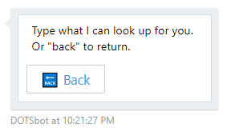

What also turned out to be confusing is that main menu buttons are always available in the chat history and users tend to click on them when they feel lost or just want to try different area without properly leaving the current one. On Facebook Messenger this can be solved by using quick actions (they dissapear after being selected) while on webchat the menu would have to be implemented as a global action. We didn't go this way in the project.

## QnA Service

To demonstrate how a chatbot can answer common questions we integrated this one with [QnA Maker service](https://qnamaker.ai). We created a new service and provided two URLs for existing e-shop's FAQ pages. 

The QnA parser is not perfect, so it required some cleanup. It can be done using the GUI editor, so it turned out to be a good practice to return to it during testing a adjust responses.

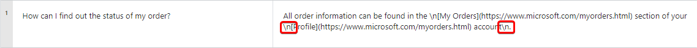

Then we added a few generic questions for which the bot doesn't actually have an answer, but at least responds in a meaningful way.

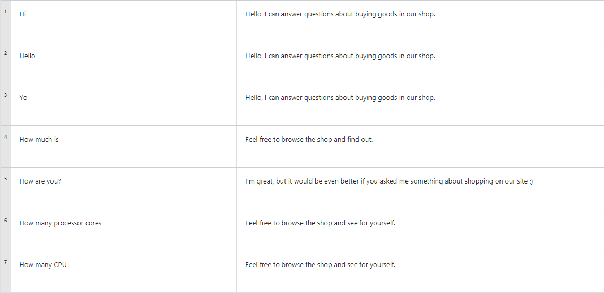

Finally, we **Saved and retrained** the model and **Published** it.

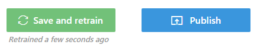

The portal then generated all information necessary to call the API from a chatbot:

```
POST /knowledgebases/<knowledgeBaseId>/generateAnswer
Host: https://westus.api.cognitive.microsoft.com/qnamaker/v2.0
Ocp-Apim-Subscription-Key: <knowledgeBaseKey>
Content-Type: application/json
{"question":"hi"}
```

Which allowed us to build the following method used by our bot:

```c#
private async Task<string> QnAMakerQueryAsync(string query)
{
    var subscriptionKey = ConfigurationManager.AppSettings["QnaSubscriptionKey"];
    var knowledgeBaseId = ConfigurationManager.AppSettings["QnaKnowledgeBaseId"];

    using (HttpClient hc = new HttpClient())
    {
        string url = $"https://westus.api.cognitive.microsoft.com/qnamaker/v1.0/knowledgebases/{knowledgeBaseId}/generateAnswer";
        var content = new StringContent($"{{\"question\": \"{query}\"}}", Encoding.UTF8, "application/json");
        hc.DefaultRequestHeaders.Add("Ocp-Apim-Subscription-Key", subscriptionKey);

        var response = await hc.PostAsync(url, content);

        if (response.IsSuccessStatusCode)
        {
            var answer = JsonConvert.DeserializeObject<QnAMakerResult>(await response.Content.ReadAsStringAsync());

            if (answer.Score >= 30)
            {
                return HttpUtility.HtmlDecode(answer.Answer);
            }
            else
            {
                return null;
            }
        }
        else
        {
            throw new QnAMakerException();
        }
    }
}
```

`QnAMakerResult` object has the following form:

```c#
public class QnAMakerResult
{
    [JsonProperty(PropertyName = "answer")]
    public string Answer { get; set; }

    [JsonProperty(PropertyName = "score")]
    public double Score { get; set; }
}
```

Where `Answer` is the text from QnA Maker and `Score` is number between 0 and 100 representing accuracy of the result. We accept everything above 30 as valid answer.

The bot itself calls QnA Maker like this:

```c#
try
{
    var answer = await QnAMakerQueryAsync(query);
    if (answer != null)
    {
        await context.PostAsync(answer);
    }
    else
    {
        await context.PostAsync("Unfortunately, I don't have an answer for this.");
    }

    await context.PostTyping();
    Thread.Sleep(1000);

    await context.PostWithQuickRepliesAsync(
        "Type what I can look up for you. Or \"back\" to return.",
        ("🔙 Back", "Back")
    );
}
catch (QnAMakerException)
{
    await context.PostAsync("Unfortunately, I don't have an answer for this.");
}
```

## Messaging Extensions

There are several operations we wanted to do repeatedly - such as:

* Sending typing indicator to the user.
* Sending *Back* as a button to the user.

To support this, there are two extension methods for `IDialogContext`.

```c#
public static class BotMessages
{
    public static async Task PostTyping(this IDialogContext context)
    {
        var typingMessage = context.MakeMessage();
        typingMessage.Type = ActivityTypes.Typing;
        typingMessage.Text = null;
        await context.PostAsync(typingMessage);
    }

    public static async Task PostWithQuickRepliesAsync(this IDialogContext context, string text, (string Description, string Value) replies)
    {
        var message = context.MakeMessage();
        message.AddKeyboardCard(text, new string[] { replies.Value }, new string[] { replies.Description });
        await context.PostAsync(message);
    }
}
```

Both of them were used in the QnA Dialog:

```c#
...

await context.PostTyping();
Thread.Sleep(1000);

await context.PostWithQuickRepliesAsync(
    "Type what I can look up for you. Or \"back\" to return.",
    ("🔙 Back", "Back")
);

...
```

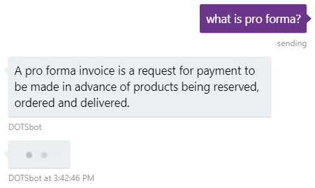

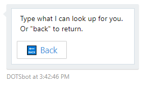

## Website Integration

This bot was intended to run as part of a fictional e-shop website. We first considered using the WebChat IFRAME control provided by Bot Framework, but eventually decided to use the [embedded WebChat](https://github.com/Microsoft/BotFramework-WebChat), because of better customization options.

So instead of an `<iframe>`, we put this piece of code to the website:

```html
<div id="chat-application" 
    style="z-index: 10000000; background: white; box-shadow: 0px 0px 20px; overflow: hidden; display: block; margin: 0px; padding: 0px; border: 0px; transition: none; position: fixed; width: 430px; height: 550px; bottom: -4px; right: 10px;">
    
    <div id="bot"></div>
    <script src="https://unpkg.com/botframework-webchat/botchat.js"></script>
    <script>
    BotChat.App({
        directLine: { secret: "<DirectLine secret>" },
        user: { id: 'dotsuser' },
        bot: { id: 'dotsbot' },
        resize: 'detect'
    }, document.getElementById("bot"));
    </script>
</div>
```

It is important to notice that it's not using the Web Chat channel. It runs on **Direct Line** instead. To get the Direct Line secret we registered our bot at [Bot Framework portal](https://dev.botframework.com) and configured the **Direct Line channel**.

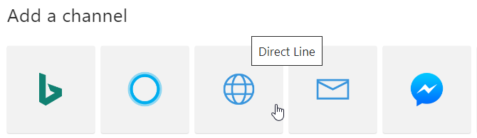

Then added new site (called *dotsdemosite* in our case) and copied the first **Secret key**.

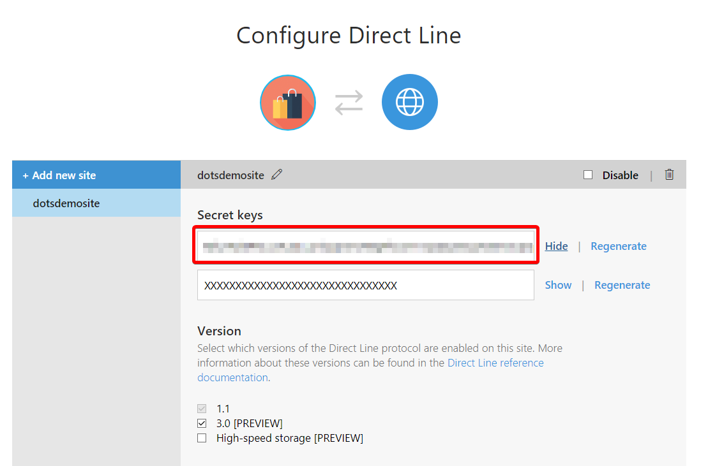

To make the bot fit our demo site better, we also provided custom CSS values. Following code goes to the page's HTML `<head>` element.

```css
<link href="https://unpkg.com/botframework-webchat/botchat.css" rel="stylesheet" />

<style>
    .wc-header, .wc-message-from-me .wc-message-content {
        background-color: #6C358C;
    }
    .wc-message-from-me svg.wc-message-callout path {
        fill: #6C358C;
    }
    .wc-card {
        width: 220px;
    }
    .wc-card.receipt {
        width: 300px;    
    }

    .wc-list > :first-child.wc-card {
        display: table;
    }
</style>
```

First we set the header color to match our branding:

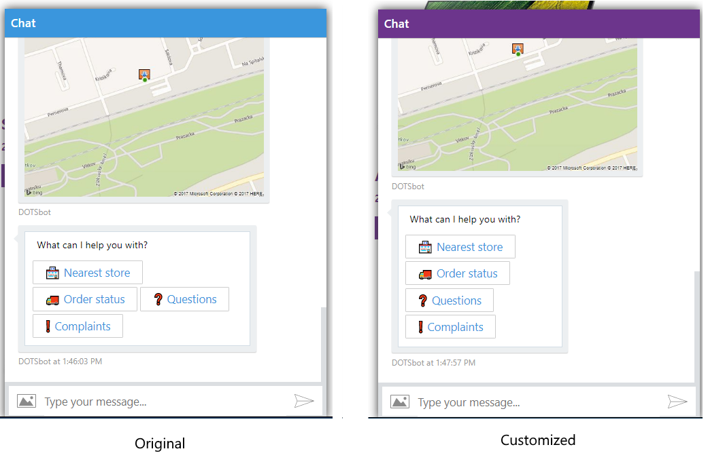

Then fixed the way main menu shows up:

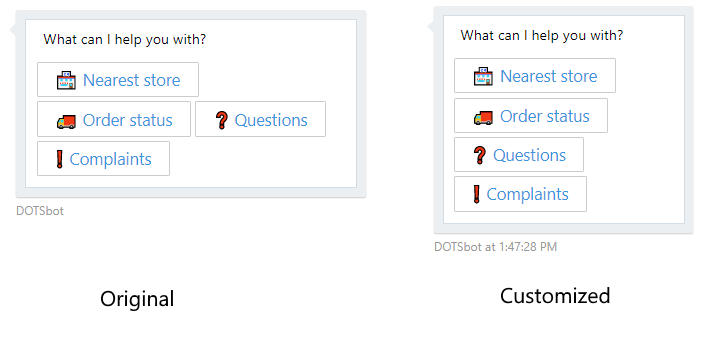

And also some of the cards:

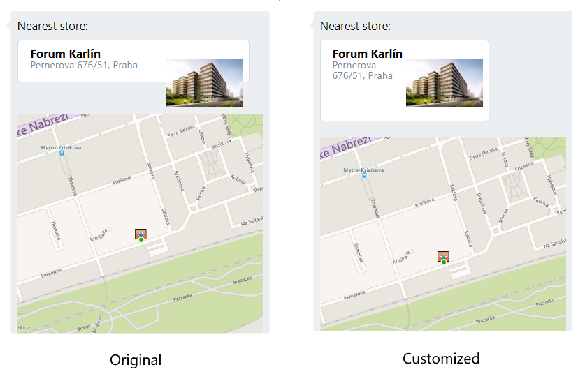

## Application Insights Telemetry

Bot Framework portal provides nice telemetry overview when connected to Azure [Application Insights](https://azure.microsoft.com/en-us/services/application-insights/) by filling the **Analytics** part in bot's **Settings**.

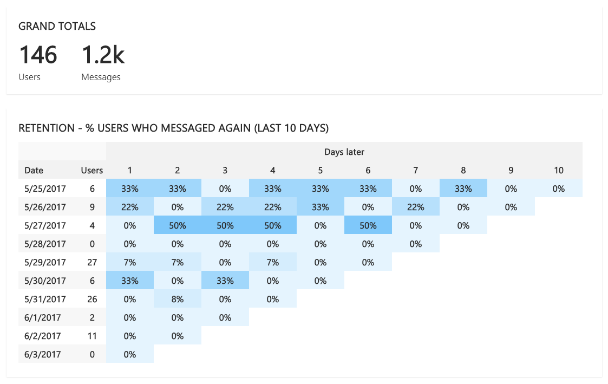

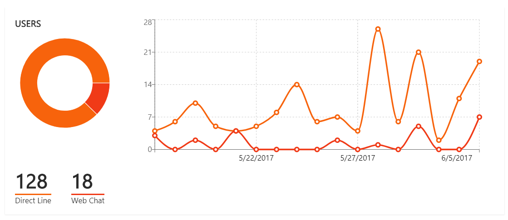

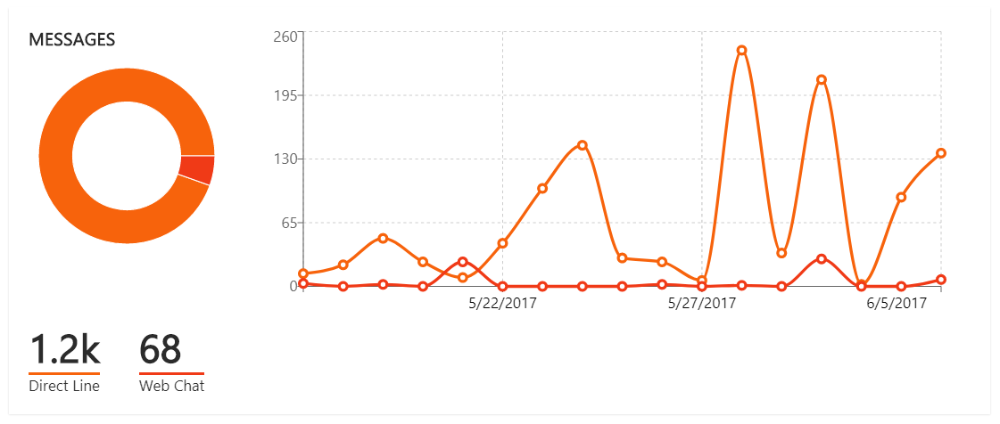

To get even more information and be able to analyze what messages users were sending to the bot and how far in the conversation structure they've got, there are also custom events being sent to Application Insights.

```c#
public async Task<HttpResponseMessage> Post([FromBody]Activity activity)
{
    if (activity.Type == ActivityTypes.Message)
    {
        var telemetryClient = new TelemetryClient();
        telemetryClient.TrackEvent("Message", new Dictionary<string, string>() { { "Text", activity.Text } });

        await Conversation.SendAsync(activity, () => new MainDialog());
    }
    else
    {
        HandleSystemMessage(activity);
    }
    var response = Request.CreateResponse(HttpStatusCode.OK);
    return response;
}
```

Then we can monitor conversations at the Application Insights portal:

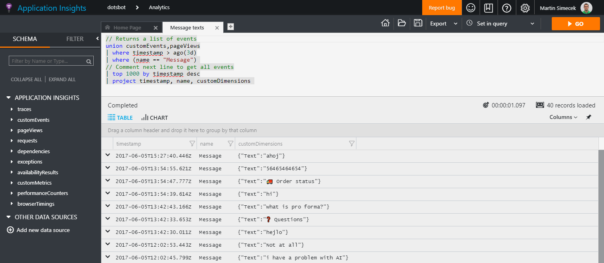

## Power BI

Application Insights is a great analytics resource for developers, but business decision makers need something different. That's why we included outputs from the chatbot on a Power BI report, which consolidates every piece of information coming from the store.

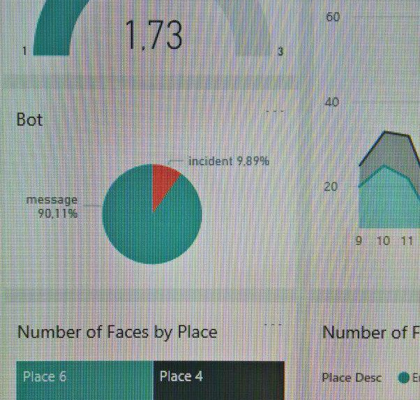

There were two integration points in the code: after a **message is received** and after a **new incident is created**. The whole solution was using Azure IoT Hub and Stream Analytics to process data points from the installation and chatbot was no different:

```c#
IotHubService.Instance.SendTelemetryAsync(new TelemetryModel());
```

```c#
public class TelemetryModel
{
    public string HostName { get; set; }
    public string ApplicationName { get; set; }
    public DateTime SentTime { get; set; }
    [JsonConverter(typeof(StringEnumConverter), true)] // as string and as camel-case
    public TelemetryType Type { get; set; }

    public TelemetryModel(TelemetryType type = TelemetryType.Message)
    {
        HostName = "dotsbot.azurewebsites.net";
        ApplicationName = "BotGenerator";
        Type = type;
    }
}
```

We registered it as a regular device in Azure IoT Hub and sent telemetry as messages.

```c#
public async Task SendTelemetryAsync(TelemetryModel data)
{
    data.SentTime = DateTime.Now;
    var connString = ConfigurationManager.ConnectionStrings["IotHub"].ConnectionString;

    try
    {
        using (DeviceClient deviceClient = DeviceClient.CreateFromConnectionString(connString, TransportType.Http1))
        {
            string telemetryData = JsonConvert.SerializeObject(data);
            await deviceClient.SendEventAsync(new Message(Encoding.UTF8.GetBytes(telemetryData)));
        }
    }
    catch (Exception ex)
    {
        // ... logging
    }
}
```